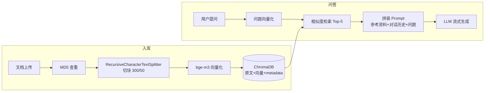

# 智能知识库问答系统（RAG）

基于 LangChain + ChromaDB 的知识库问答应用：上传文档自动入库，多轮对话问答，流式输出。以服装售前客服为示例场景（尺码推荐 / 洗涤养护 / 颜色选择），知识库内容可替换为任意领域。

## ✨ 功能特性

- **文档入库**：上传文本文档 → 自动切块（chunk_size=300 / overlap=50）→ 向量化 → 存入 ChromaDB，MD5 去重防止重复录入
- **语义检索**：用户问题向量化后与知识库比对余弦相似度，召回 Top-5 相关片段
- **多轮对话**：按 session_id 隔离对话历史，历史持久化到本地文件，支持上下文连续问答
- **流式输出**：逐 token 返回，前端实时渲染
- **双形态架构**：Streamlit 快速原型版 + Django/FastAPI 工程化版（Swagger 文档、Django Admin 后台、服务单例模式）

## 🏗️ 架构



## 🛠️ 技术栈

| 层 | 技术 |
|---|---|
| 编排 | LangChain（LCEL 链、RunnableWithMessageHistory） |
| 向量库 | ChromaDB（本地持久化） |
| 模型 | BAAI/bge-m3（Embedding）+ DeepSeek（Chat），经 SiliconFlow API 调用 |
| 后端 | Django + FastAPI（uvicorn 部署） |
| 界面 | Streamlit（快速版）/ 静态页（工程版） |

## 🚀 快速开始

```bash
# 1. 安装依赖
pip install -r requirements.txt

# 2. 配置密钥（SiliconFlow 平台申请，设为环境变量）
#    Windows: setx OPENAI_API_KEY "你的密钥"   （重开终端生效）
#    Linux/Mac: export OPENAI_API_KEY="你的密钥"

# 3a. Streamlit 快速版
streamlit run app_qa.py

# 3b. 工程化版（Django + FastAPI）
python manage.py migrate
python manage.py createsuperuser
python run.py --port 8000
# 聊天界面:  http://127.0.0.1:8000
# API 文档:  http://127.0.0.1:8000/api/docs
# Admin:    http://127.0.0.1:8000/admin
```

## 📁 目录结构

```
├── app_qa.py               # Streamlit 问答界面
├── app_file_uploader.py    # Streamlit 文档上传界面
├── rag.py                  # RAG 链（LCEL 编排）
├── knowledge_base.py       # 知识库服务（切块/入库/MD5 去重）
├── vector_stores.py        # 向量库服务（检索器封装）
├── file_history_store.py   # 对话历史持久化（按 session 隔离）
├── config_data.py          # 参数配置（chunk/模型/检索 k 值）
├── apps/                   # 工程化版本
│   ├── api/                # FastAPI 路由（knowledge / qa）
│   └── core/               # Django app（模型、服务层、单例）
├── data/                   # 示例知识库文档
└── run.py                  # 工程化版启动脚本
```

## 🔬 优化实验记录

> 目标：用数据代替"默认参数"，持续迭代检索质量。

| 实验 | 状态 | 结论 |
|---|---|---|
| chunk_size / overlap 对检索命中率的影响 | 🚧 进行中 | 待补数据 |
| 引用溯源（回答标注来源文档） | 📅 计划中 | — |
| 检索质量评估集（10+ 测试问题） | 📅 计划中 | — |

## 📝 说明

- `chat_history/`、`chroma_db/`、`md5.text` 等运行时数据均不入库（见 .gitignore），克隆后按"快速开始"重建即可
- 密钥仅通过环境变量 `OPENAI_API_KEY` 提供，不进入代码与仓库
